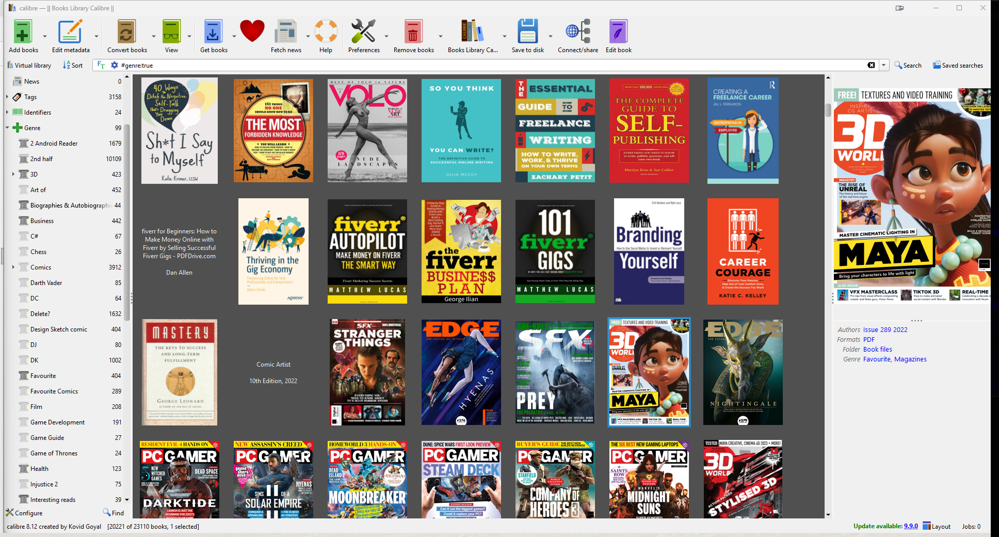

# Reading List Playlist for calibre

Reading List Playlist is a GPLv3 calibre plugin derived from Grant Drake's excellent
Reading List plugin. It keeps the core idea simple: playlist-style queues for books,
with ordered lists, device/folder sync, and quick "what should I read next?" views.

This derivative adds one focused quality-of-life fix for large custom Genre
libraries: when calibre's Tag Browser would normally switch a 100+ item Genre
category into a partitioned/grouped view, this plugin keeps Genre in the normal
flat list view.



## What It Does

- Create ordered, playlist-style book lists.
- Add, remove, move, edit, and view books in each list.
- Sync reading lists to configured devices or folders.
- Preserve the upstream Reading List library preference namespace so existing
  Reading List data can continue to work.
- Automatically keep a custom Genre category, usually `#genre`, out of calibre's
  Tag Browser partitioning.
- Provide a manual menu action: `Keep Genre view flat`.
- Use the `Playlist / Genre` menu to add selected books to the last playlist,
  see which playlists they are already on, add a Genre, or turn selected Genre
  values into syncable Reading List playlists.
- Use the dedicated `Readlist` sidebar category, placed above Genre, as the
  default queue for books intended for an SD card or connected folder.
- Use `No cover books` to see every library book missing a Calibre cover.
- Select books in that view and choose `Find & download missing covers...` to
  extract embedded covers or search Google Books, Open Library, and Internet
  Archive, then save suitable results as Calibre-managed covers.
- Choose `Find missing book files on this computer...` to search a folder,
  drive, or all local drives and attach a matching ebook file to the selected
  Calibre record.

## Genre Flat-View Fix

calibre has a Tag Browser preference that partitions large categories after a
threshold, commonly 100 items. That is useful for some fields, but it can make a
custom Genre column feel like it suddenly changed shape once the list grows.

This plugin applies the same preference calibre uses internally:

```text
tag_browser_dont_collapse = ["#genre"]
```

The fix is applied when the plugin starts and again when you switch libraries. If
your Genre column has a different lookup name, the plugin looks for a category whose
label or display name is `Genre`.

## Install From Source

1. Download or clone this repository.
2. Build the plugin zip:

   ```powershell
   .\tools\package.ps1
   ```

3. In calibre, open `Preferences > Plugins > Load plugin from file`.
4. Select the generated zip from `dist\Reading_List_Playlist.zip`.
5. Restart calibre.

## Credits and Rights

This project is a modified derivative of:

- Original project: [kiwidude68/calibre_plugins](https://github.com/kiwidude68/calibre_plugins)
- Original plugin: [Reading List](https://github.com/kiwidude68/calibre_plugins/tree/main/reading_list)
- Original author: Grant Drake, also known as kiwidude in the calibre/MobileRead community

The original Reading List plugin is licensed under the GNU General Public License
version 3. This derivative remains GPLv3. See [LICENSE.md](LICENSE.md) and
[NOTICE.md](NOTICE.md).

## Project Direction

This repo is intended to be a base for practical, optimized calibre plugins:
small fixes, cleaner workflows, and book-library tools that respect calibre's
existing data model instead of fighting it.
